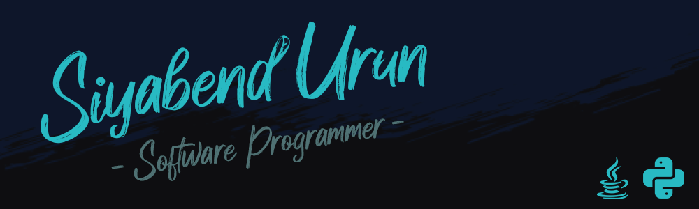

 

## Hi there, I'm Siyabend👋

🖥️ Currently exploring new technologies, working on backend development

🎓 Studying Computer Engineering at Ege University

💯 Skilled at software development and graphic design

🌱 Learning more about API Design, Software Architecture and Microservice Architecture
 
 

 

### Technologies and Libraries

